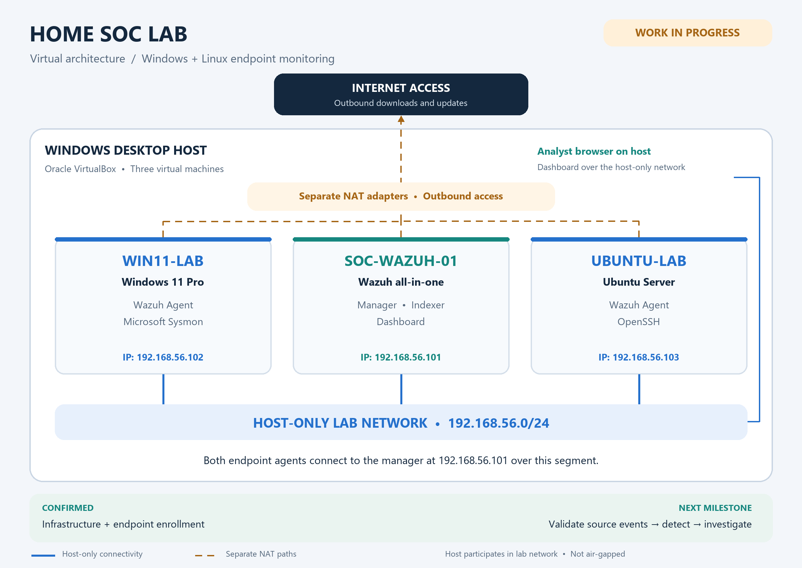

# Home SOC Lab

**A virtual SOC and detection-engineering case study**  
**Status: Work in progress · Infrastructure and agent enrollment complete**

This personal lab brings Windows and Linux endpoints into a Wazuh environment on a Windows desktop running Oracle VirtualBox. The infrastructure is working and both endpoint agents are visible in the dashboard. The next milestone is to demonstrate the complete analyst workflow with evidence:

**Generate controlled activity → collect telemetry → detect → investigate → improve.**

This repository documents the foundation and the work ahead. No completed detection cases, incident investigations, or automation results are claimed in this version. This is a personal learning environment; it does not represent production SOC operations or employer experience.

## Project goals

- Establish reliable Windows and Linux telemetry and identify collection gaps.
- Build repeatable detection scenarios with explicit hypotheses and test criteria.
- Investigate alerts using timelines, affected assets, source activity, and supporting evidence.
- Explain false positives, visibility limits, and detection improvements.
- Map observed behavior to MITRE ATT&CK with a written rationale.
- Develop small parsing and enrichment utilities after the manual workflow is validated.

## Current status

| Area | Status | Evidence boundary |
|---|---|---|
| VirtualBox and three VMs | Complete | Wazuh server, Windows 11 Pro, and Ubuntu Server are running. |
| Lab networking | Complete | Host-only lab segment plus NAT adapters; VM addresses are `192.168.56.101`–`192.168.56.103`. |
| Wazuh dashboard | Complete | Dashboard is accessible; both endpoint agents are visible. |
| Windows Wazuh Agent | Complete | Manual client-key enrollment succeeded; service reported `Running`. |
| Ubuntu Wazuh Agent | Complete | Package installed with `curl` workaround; service reported active/running. |
| Sysmon and OpenSSH | Installed | Sysmon on Windows; OpenSSH on Ubuntu. |
| Event-source validation | Pending | Sysmon ingestion and SSH authentication visibility in Wazuh still need documented verification. |
| Detections and investigations | Planned | No test results or completed cases yet. |
| Automation | Planned | No scripts implemented in this repository. |

Status reflects the owner's build record as of **September 5, 2026**. This documentation was prepared from that record; it is not a fresh inspection of the running VMs. Agent connectivity alone does not establish detection coverage. Screenshots and exported evidence have not yet been added.

## Architecture overview



All three VMs run on one Windows desktop. Their host-only interfaces share the `192.168.56.0/24` lab segment. `SOC-WAZUH-01` uses `192.168.56.101`, `WIN11-LAB` uses `192.168.56.102`, and `UBUNTU-LAB` uses `192.168.56.103`. The Windows and Ubuntu agents connect to the Wazuh manager at `192.168.56.101`. Separate NAT interfaces provide outbound internet access for updates and downloads. The host accesses the Wazuh dashboard through the host-only network.

The lab segment is separate from the physical LAN at the virtual network layer. The desktop still participates in it, and NAT permits outbound traffic; this is **not an air-gapped environment**. See the [architecture and network boundaries](architecture/architecture.md) for details.

## Technologies

| Component | Role in this case study |
|---|---|
| Windows desktop + Oracle VirtualBox | Hosts and manages the three VMs and virtual networks. |
| Wazuh all-in-one VM (`SOC-WAZUH-01`) | Central manager, indexer, and dashboard in one VM. |
| Windows 11 Pro (`WIN11-LAB`) | Windows endpoint with Wazuh Agent and Microsoft Sysmon. |
| Ubuntu Server (`UBUNTU-LAB`) | Linux endpoint with Wazuh Agent and OpenSSH. |
| Host-only networking + NAT | Lab communication and a separate outbound update path. |
| MITRE ATT&CK | Planned framework for explaining tested behavior; no coverage claim yet. |

The recorded Ubuntu agent package is `4.14.7-1` for `amd64`. Other installed versions and final resource allocations have not been inventoried here.

### VM addressing

| VM | Host-only IP address | Role |
|---|---|---|
| `SOC-WAZUH-01` | `192.168.56.101` | Wazuh manager, indexer, and dashboard |
| `WIN11-LAB` | `192.168.56.102` | Windows endpoint with Wazuh Agent and Sysmon |
| `UBUNTU-LAB` | `192.168.56.103` | Ubuntu endpoint with Wazuh Agent and OpenSSH |

## Planned detection scenarios

**Every scenario below is planned and untested in this repository.** Proposed signals must be verified before writing detection logic or assigning ATT&CK mappings.

| Case | Scenario | Telemetry to validate | Analyst question |
|---|---|---|---|
| SOC-001 | Repeated SSH authentication failures on Ubuntu | SSH authentication records collected by Wazuh | Which source and accounts were involved, over what time window, and was there a later success? |
| SOC-002 | Test account added to local Administrators | Windows Security account and group-change events; audit settings required | Who granted privilege, to whom, and was it expected? |
| SOC-003 | Suspicious-looking PowerShell using harmless test content | Sysmon process creation and PowerShell logs, subject to collection configuration | What command ran, what launched it, and what context makes it suspicious? |
| SOC-004 | Scheduled task created for a benign test action | Task Scheduler/Security events and process telemetry, subject to configuration | What created the task and what would it execute? |
| SOC-005 | Small, scoped port scan between owned lab VMs | Suitable endpoint/firewall/network records; visibility must be established first | Can the available data show a pattern across destination ports? |
| SOC-006 | Change to a designated test file on Ubuntu | Wazuh file-integrity monitoring for an explicitly configured test path | What changed, when, and what attribution does the evidence actually support? |

The current design has no dedicated network sensor. SOC-005 depends on establishing suitable visibility; installing endpoint agents does not by itself prove scan detection.

## Roadmap and completion criteria

- [x] Build the three-VM environment and enroll both endpoints.
- [x] Document the architecture and known setup lessons.
- [x] Record the host-only IP address assigned to each VM.
- [ ] Inventory exact software versions, VM allocations, and existing recovery snapshots.
- [ ] Validate one Sysmon event and one SSH authentication event from source through Wazuh; record collection settings and sanitized evidence.
- [ ] Complete SOC-001 with a repeatable test, time window, actual observed rule/query results, and a benign comparison.
- [ ] Expand to the remaining scenarios only after their data sources are validated.
- [ ] Write at least three investigations covering timeline, evidence, interpretation, limitations, and response recommendations.
- [ ] Add tested parsing or enrichment utilities with sample lab-only inputs.
- [ ] Review evidence and obtain explicit owner approval before any GitHub publishing.

A detection is complete only when its write-up records the hypothesis, prerequisites, exact test activity, expected versus observed result, detection logic, false-positive considerations, and an ATT&CK rationale where applicable. An incident report must distinguish actions actually performed from proposed response steps. Successful enrollment is the foundation for these milestones.

## Documentation and repository layout

- [Architecture](architecture/architecture.md): VM roles, network design, data flow, and limitations.
- [Completed setup](docs/setup.md): infrastructure and enrollment record.
- [Troubleshooting](docs/troubleshooting.md): issues encountered, causes or uncertainties, and resolutions.

```text
home-soc-lab/
├── README.md
├── .gitignore
├── architecture/
│   ├── architecture.md
│   └── network-diagram.png
├── docs/
│   ├── setup.md
│   └── troubleshooting.md
├── detections/
│   └── .gitkeep
├── incident-reports/
│   └── .gitkeep
├── screenshots/
│   └── .gitkeep
└── scripts/
    └── .gitkeep
```

The four placeholder directories intentionally contain no detections, reports, screenshots, or scripts yet.

## Security, privacy, and publication

**No employer data or sensitive credentials should ever be published.** Use only owned lab systems and lab-generated activity. Never include employer/customer logs, real incident details, passwords, Wazuh client authentication keys, API tokens, SSH private keys, or personal account information.

Review future screenshots, logs, command lines, and configuration exports before adding them. Redact secrets and identifying data while keeping enough context to explain the case. The private manager address shown here is intentional lab context. VM disks, snapshots, installers, and credential stores do not belong in this repository. The `.gitignore` provides basic exclusions; it does not replace content review.

**Publication state: local and unpublished.** No GitHub repository has been created or modified, and nothing has been pushed. Publishing requires the owner's explicit approval.
